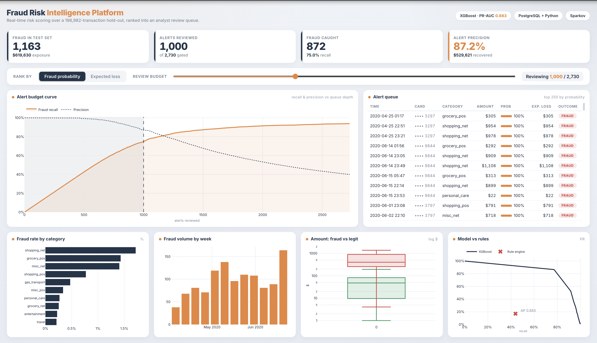
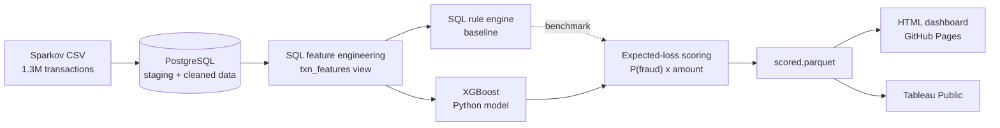
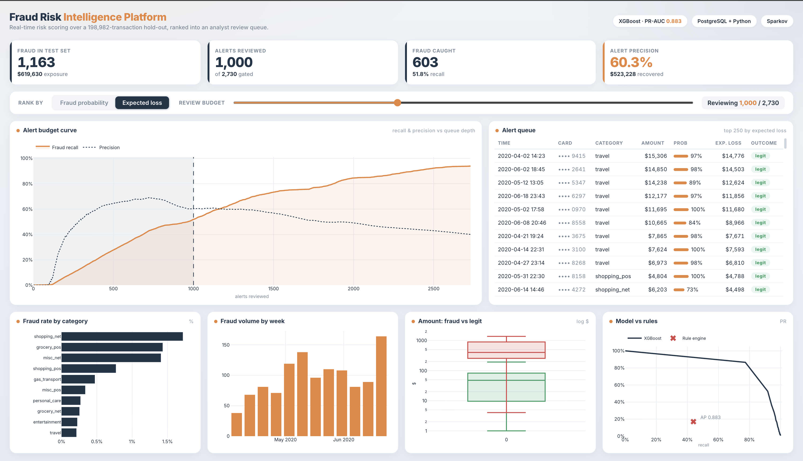
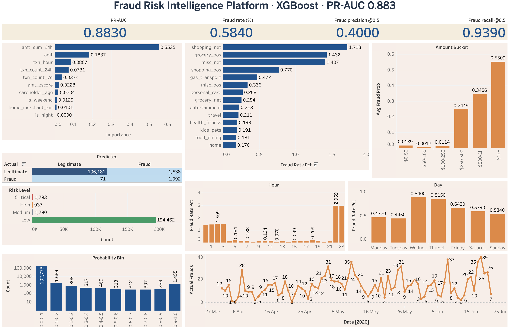

# Fraud Risk Intelligence Platform

A complete fraud detection and investigation platform built with PostgreSQL, Python, XGBoost and interactive dashboards.

The platform scores credit-card transactions, identifies suspicious activity and ranks alerts by their expected financial loss. This helps investigators focus on the transactions that create the highest risk instead of reviewing alerts in a random order.


### Links

- [Live dashboard](https://nihira11.github.io/fraud-risk-intelligence-platform/dashboard/)
- [Tableau Public](https://public.tableau.com/app/profile/nihira.sharma/viz/FraudRiskIntelligencePlatform/Fraud_Risk_Intelligence?publish=yes)
- [Presentation (PDF)](presentation.pdf)
- [Sparkov Dataset on Kaggle](https://www.kaggle.com/datasets/kartik2112/fraud-detection)



<p align="center">
  <sub><em>
    The live dashboard analyses 198,982 test transactions. It shows model performance, fraud trends, spending patterns and a ranked alert queue that helps investigators focus on high-value risks.
  </em></sub>
</p>


---

## Overview

Credit-card fraud makes up only a small percentage of overall transactions but it can still cause major financial losses. The challenge is not simply finding fraud. A fraud system must also limit false alarms and help investigators decide which alerts should be reviewed first.

This project creates a complete fraud detection process that:

- Scores every transaction using a machine learning model
- Identifies suspicious transactions
- Ranks alerts by expected financial loss
- Measures how much fraud can be found with a limited investigation budget
- Shows the results through operational and analytical dashboards

The project uses a **SQL-first** structure. PostgreSQL handles the main data processing and feature engineering, while Python is mainly used to train the models and score transactions. This is similar to many real analytics systems where large amounts of data are processed inside the database before being passed to a machine learning model.

An eight-slide summary deck covering the problem, system structure, results and expected-loss method is available in **[presentation.pdf](presentation.pdf)**.

---

## Key results

The machine-learning models are evaluated against a transparent SQL rule engine using a **time-based train/test split** (training before 2020-04-01 and testing on Apr–Jun 2020). This creates a more realistic evaluation by ensuring future transactions are scored using information available only from the past.

This project is designed as a decision tool for a fraud investigation team, not only as a fraud prediction model.

### Expected-Loss Alert Ranking

The platform ranks alerts using:
```
Expected Loss = Probability of Fraud × Transaction Amount
```
This method considers both the chance of fraud and the amount of money at risk.

Reviewing the top **1,000 alerts** from a total of 2,730:

- Finds around **75% of all fraud cases**
- Covers approximately **$529,600**
- Captures about **85% of the total fraud-dollar exposure**

This means a small investigation team can focus on the alerts with the greatest financial importance instead of reviewing every alert equally.

### Model Comparison

Several machine learning models were compared with a transparent SQL rule engine.

A time-based train and test split was used:

- **Training data:** Transactions before 1 April 2020
- **Test data:** Transactions from April to June 2020

This creates a more realistic test because the models are trained using past transactions and evaluated on future transactions.

| Model | PR-AUC | Precision @ 43.9% recall |
|---|---|---|
| **XGBoost** (production) | **0.883** | **99.2%** |
| LightGBM | 0.870 | 98.5% |
| Random Forest | 0.846 | 98.3% |
| Logistic Regression | 0.402 | 53.5% |
| Isolation Forest | 0.326 | 45.8% |
| SQL Rule engine (baseline) | — | 17.0% |

At the same recall level of 43.9%:

- XGBoost reaches 99.2% precision
- Logistic Regression reaches 53.5% precision
- The SQL rule engine reaches only 17% precision

In simple terms, XGBoost finds the same amount of fraud while producing far fewer false alerts.

Isolation Forest was included as an unsupervised model, meaning it was trained without fraud labels. It performed worse than the supervised models, which is expected because labelled fraud data was available.

> **Important:** The Sparkov dataset is synthetic and contains strong fraud patterns. This makes fraud easier to detect than it would be with real banking data. These results should be viewed as a project demonstration, not as expected performance in a real production system.

---

## What the data showed

### Transaction Amount Was the Strongest Signal

A transaction amount z-score was calculated for each card. This measures how unusual a transaction is compared with the cardholder’s normal spending. Fraudulent transactions were, on average, around 3.2 standard deviations above the cardholder’s usual spending behaviour.

### Geographic Features Were Not Useful

The following geographic features showed very little value:
- Distance between the cardholder and merchant
- Estimated travel speed between transactions

This happened because the merchant locations in the Sparkov dataset were randomly generated and did not represent realistic travel patterns. Because of this, `implied_kmh` was removed from the final model. This is still an important result because it shows that features should be tested before being included in a model.

### Time and Transaction Speed Added Some Value

Fraudulent cards showed slightly more short-term transaction activity. The data also showed that the fraud rate at night was more than twice the fraud rate during the day.

---

## Architecture



**Why SQL-first?**

The main features are created inside PostgreSQL using the materialised view in `sql/03_features.sql`

These features include:

- Recent transaction activity
- Card-level transaction amount z-scores
- Geographic calculations
- Time-based features

Using PostgreSQL for feature engineering:

- Keeps large data processing inside the database
- Makes the process easier to repeat
- Demonstrates advanced SQL skills
- Allows Python to focus on machine learning and scoring

---

## Tech stack

| Category | Tools |
| -------------- | ---------------------------- |
| Database | PostgreSQL 17 |
| Programming language | Python 3.11 |
| Machine learning | XGBoost, LightGBM, scikit-learn |
| Data processing | pandas, SQLAlchemy |
| Web dashboard | Plotly.js, HTML, CSS, JavaScript |
| Business intelligence | Tableau Public |
| Dataset | Sparkov synthetic credit-card transactions |

The dataset contains around 1.3 million transactions from January 2019 to June 2020.

---

## Repository structure

```
fraud-risk-intelligence-platform/
│
├── data/
│   ├── raw/                            # fraudTrain.csv (gitignored, downloaded from Kaggle)
│   └── processed/                      # scored.parquet
│
├── models/                             # saved trained ML model (XGBoost)
│   └── xgb_fraud.pkl
│
├── notebooks/ 
│   ├── 01_eda.ipynb                    # EDA (signal vs no-signal per feature family)
│   └── 02_model_dev.ipynb              # model comparison and PR curves
│
├── sql/
│   ├── 01_schema.sql                   # creates the database tables
│   ├── 02_load.sql                     # data loading and ingestion scripts
│   ├── 03_features.sql                 # SQL feature engineering pipeline
│   ├── 04_rules.sql                    # rule-based fraud detection engine
│   └── 05_feature_matrix.sql           # final ML-ready feature dataset
│
├── src/
│   ├── db.py                           # SQLAlchemy engine from DATABASE_URL
│   ├── features.py                     # feature matrix loader + time-based split
│   ├── train.py                        # five-model bake-off, saves the production model
│   └── risk.py                         # expected-loss scoring → scored.parquet
│
├── dashbaord/                          # the live HTML dashboard
│   ├── data.js
│   └── index.html
│
├── tableau_data/                       # CSV extracts that feed the Tableau workbook
│   ├── 01_metrics.csv
│   ├── 02_risk_distribution.csv
│   ├── 03_daily_trends.csv
│   ├── 04_hourly_pattern.csv
│   ├── 05_dow_pattern.csv
│   ├── 06_amount_bins.csv
│   ├── 07_confusion_matrix.csv
│   ├── 08_feature_importance.csv
│   ├── 09_prob_distribution.csv
│   └── 10_category_fraud.csv
│
├── screenshots/                        # dashboard screenshots for documentation
│   ├── dashbaord_main.png
│   ├── dashboard_expected_loss.png
│   └── tableau_dashbaord.png
│
├── export_web.py                       # scored.parquet → dashboard/data.js
├── prep_tableau.py                     # scored.parquet → tableau_data/*.csv
├── .env.example                        # example environment variables template
├── .gitignore
├── README.md
├── requirements.txt
└── presentation.pdf                    # project presentation and summary slide deck
```

---

## Running it locally

```bash
# 1. Clone and set up the environment
git clone https://github.com/Nihira11/fraud-risk-intelligence-platform.git
cd fraud-risk-intelligence-platform
python -m venv .venv && source .venv/bin/activate
pip install -r requirements.txt

# 2. Create the PostgreSQL database
createdb fraud_detection

# Copy the example environment file
cp .env.example .env

# Add your PostgreSQL connection details to the .env file. The expected DATABASE_URL format is shown in .env.example 

# 3. Load the database connection into the terminal
set -a
source .env
set +a

# 4. Download fraudTrain.csv from Kaggle and place it in data/raw/
# https://www.kaggle.com/datasets/kartik2112/fraud-detection

# 5. Run the SQL files in order
psql "$DATABASE_URL" -f sql/01_schema.sql
psql "$DATABASE_URL" -f sql/02_load.sql
psql "$DATABASE_URL" -f sql/03_features.sql
psql "$DATABASE_URL" -f sql/04_rules.sql
psql "$DATABASE_URL" -f sql/05_feature_matrix.sql

# 5. Train and score
python src/train.py        # trains the bake-off, saves models/xgb_fraud.pkl
python src/risk.py         # scores the test set → data/processed/scored.parquet

# 6. Build the dashboard data
python export_web.py       # → dashboard/data.js   (then open dashboard/index.html)
python prep_tableau.py     # → tableau_data/*.csv  (for the Tableau workbook)
```
After running `export_web.py`, open `dashboard/index.html` to view the local dashboard.

The notebooks connect directly to PostgreSQL through the files in `src/`. Make sure the database is running and the Python environment is active before opening them.

---

## Dashboards

### Operational HTML Dashboard

The main dashboard is a single-screen fraud investigation console built with Plotly.js and JavaScript.

It includes:

- Model performance KPIs
- Alert budget analysis
- Recall and precision comparisons
- Expected-loss alert rankings
- Fraud trends
- Transaction category and amount patterns
- A queue of transactions for investigators to review

The dashboard is hosted on GitHub Pages and can be opened using the live dashboard link above.


<p align="center">
  <sub><em>
    The dashboard shows 198,982 test transactions scored by XGBoost. Alerts can be ranked by fraud probability or expected loss. Expected-loss ranking gives more importance to high-value transactions, even when their fraud probability is slightly lower.
  </em></sub>
</p>


### Tableau Public Dashboard

The Tableau dashboard provides a more detailed view of the same model results.

It includes:

- Model performance
- Feature importance
- Confusion matrix results
- Fraud rates by category and amount
- Risk-level groups
- Fraud probability ranges
- Fraud patterns by hour, day and time period


<p align="center">
  <sub><em>
    The Tableau dashboard explores model results, important features, fraud patterns, risk levels and transaction behaviour across different categories and time periods.
  </em></sub>
</p>

---

## Dataset & acknowledgements

Data: the [Sparkov synthetic credit-card transaction dataset](https://www.kaggle.com/datasets/kartik2112/fraud-detection) (Kaggle, `kartik2112/fraud-detection`)

The dataset contains:

- **1,296,675 transactions**
- Transactions from January 2019 to June 2020
- An overall fraud rate of approximately **0.58%**

The dataset is completely synthetic. This means the model results should only be understood within the limits of this dataset and should not be treated as expected performance on real banking data.

---
