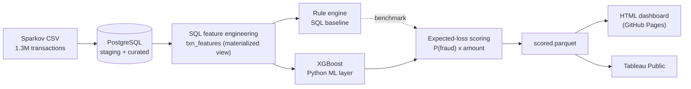

# Fraud Risk Intelligence Platform

A SQL-first fraud detection and risk intelligence platform that combines PostgreSQL feature engineering, an XGBoost fraud model, a transparent SQL rule engine baseline and an expected-loss alert prioritisation system. The final output is delivered through a live operational dashboard designed to simulate a real-world fraud investigation workflow.


### Links

- [Live dashboard](https://nihira11.github.io/fraud-risk-intelligence-platform/dashboard/)
- [Tableau Public](https://public.tableau.com/app/profile/nihira.sharma/viz/FraudRiskIntelligencePlatform/Fraud_Risk_Intelligence?publish=yes)
- [Presentation (PDF)](presentation.pdf)
- [Dataset (Sparkov, Kaggle)](https://www.kaggle.com/datasets/kartik2112/fraud-detection)


<p align="center">
  <sub><em>
  Live HTML fraud-risk dashboard for the 198,982-transaction hold-out, combining model performance KPIs, an alert-budget recall–precision curve, fraud trend analysis, category and amount patterns and a risk-ranked analyst queue for prioritizing high-value investigations.
  </em></sub>
</p>


---

## Overview

Credit-card fraud represents only a small percentage of overall transactions but it can create significant financial losses. The challenge is not simply identifying fraud but identifying it accurately enough that a limited team of investigators can review alerts efficiently. This project builds an end-to-end fraud detection workflow that scores every transaction, ranks suspicious activity into a prioritised review queue and measures the trade-off between analyst effort, fraud detection rates and recovered fraud exposure.

The project follows a deliberately **SQL-first** architecture. All feature engineering is performed inside PostgreSQL while Python is used only for model training and scoring. This approach mirrors how many production analytics pipelines operate and keeps the heavy data processing inside the database layer.

A eight-slide summary deck (problem, architecture, results, and the expected-loss idea) is included as **[presentation.pdf](presentation.pdf)** for a quick walkthrough.

---

## Key results

The machine-learning models are evaluated against a transparent SQL rule engine using a **time-based train/test split** (training before 2020-04-01 and testing on Apr–Jun 2020). This creates a more realistic evaluation by ensuring future transactions are scored using information available only from the past.

| Model | PR-AUC | Precision @ 43.9% recall |
|---|---|---|
| **XGBoost** (production) | **0.883** | **99.2%** |
| LightGBM | 0.870 | 98.5% |
| Random Forest | 0.846 | 98.3% |
| Logistic Regression | 0.402 | 53.5% |
| Isolation Forest (unsupervised) | 0.326 | 45.8% |
| Rule engine (SQL baseline) | — | 17.0% |

- At the rule engine's recall level of **43.9%**, the XGBoost model improves precision from **17% to 99.2%**, dramatically reducing false-positive alerts.
- Reviewing the top **1,000 of 2,730** ranked alerts captures approximately **75% of all fraud cases** while recovering around **$529,600 (85%)** of fraud-dollar exposure during the test period.
- Isolation Forest is included as an unsupervised benchmark and performs significantly worse than the supervised models which is expected when labelled fraud data is available.

**Important note:** The Sparkov dataset is synthetic and contains strong fraud patterns that make the problem easier than real-world fraud detection. The performance metrics shown here should therefore be interpreted as an upper-bound demonstration rather than production expectations.

---

## What the data showed (EDA)

- **Transaction amount behaviour was the strongest signal.** A per-card amount z-score clearly separates fraudulent and legitimate transactions. Fraudulent transactions average approximately 3.2 standard deviations above a cardholder's normal spending behaviour.
- **Geographic features produced a documented negative result.** Home-to-merchant distance and impossible-travel speed showed almost no predictive value because merchant coordinates in Sparkov are generated randomly rather than reflecting realistic movement patterns. As a result, `implied_kmh` was removed from the final model matrix.
- **Velocity and time-based features provided moderate lift.** Fraudulent transactions show slightly higher short-term activity levels, and night-time fraud rates are more than twice daytime fraud rates.

---

## Architecture



**Why SQL-first?**

The rolling transaction-velocity features, card-level amount z-scores, and geographic calculations are all generated inside PostgreSQL through a single materialised view (`sql/03_features.sql`). This approach highlights advanced SQL feature-engineering skills, keeps the pipeline reproducible, and ensures Python focuses purely on machine-learning tasks rather than data preparation.

---

## Tech stack

- **Database:** PostgreSQL 17 (schema, SQL feature engineering, rule engine)
- **ML / Python:** pandas, scikit-learn, XGBoost, LightGBM, SQLAlchemy
- **Dashboards:** Plotly.js + vanilla JavaScript (custom HTML dashboard), Tableau Public
- **Data:** Sparkov synthetic credit-card transactions (1.3M rows, Jan 2019 – Jun 2020)

---

## Repository structure

```
fraud-risk-intelligence-platform/
│
├── data/
│   ├── raw/                            # fraudTrain.csv (gitignored, downloaded from Kaggle)
│   └── processed/                      # scored.parquet
│
├── models/                             # saved trained ML model
│   └── xgb_fraud.pkl
│
├── notebooks/ 
│   ├── 01_eda.ipynb                    # EDA (signal vs no-signal per feature family)
│   └── 02_model_dev.ipynb              # narrated model bake-off + PR curves
│
├── sql/
│   ├── 01_schema.sql                   # database schema and table creation
│   ├── 02_load.sql                     # data loading and ingestion scripts
│   ├── 03_features.sql                 # SQL feature engineering pipeline
│   ├── 04_rules.sql                    # rule-based fraud detection engine
│   └── 05_feature_matrix.sql           # final ML-ready feature dataset
│
├── src/
│   ├── db.py                           # SQLAlchemy engine from DATABASE_URL
│   ├── features.py                     # feature matrix loader + time-based split
│   ├── train.py                        # five-model bake-off, saves the production model
│   └── risk.py                         # expected-loss scoring → scored.parquet
│
├── dashbaord/                          # the live HTML dashboard
│   ├── data.js
│   └── index.html
│
├── tableau_data/                       # CSV extracts that feed the Tableau workbook
│   ├── 01_metrics.csv
│   ├── 02_risk_distribution.csv
│   ├── 03_daily_trends.csv
│   ├── 04_hourly_pattern.csv
│   ├── 05_dow_pattern.csv
│   ├── 06_amount_bins.csv
│   ├── 07_confusion_matrix.csv
│   ├── 08_feature_importance.csv
│   ├── 09_prob_distribution.csv
│   └── 10_category_fraud.csv
│
├── screenshots/                        # dashboard screenshots for documentation
│   ├── dashbaord_main.png
│   ├── dashboard_expected_loss.png
│   └── tableau_dashbaord.png
│
├── export_web.py                       # scored.parquet → dashboard/data.js
├── prep_tableau.py                     # scored.parquet → tableau_data/*.csv
├── .env.example                        # example environment variables template
├── .gitignore
├── README.md
├── requirements.txt
└── presentation.pdf                    # project presentation and summary slide deck
```

---

## Running it locally

```bash
# 1. Clone and set up the environment
git clone https://github.com/Nihira11/fraud-risk-intelligence-platform.git
cd fraud-risk-intelligence-platform
python -m venv .venv && source .venv/bin/activate
pip install -r requirements.txt

# 2. Create the database and point .env at it
#    (copy .env.example to .env and set DATABASE_URL)
createdb fraud_detection
cp .env.example .env
#      Then edit .env with your local PostgreSQL credentials. The expected DATABASE_URL format is shown in .env.example 

# 3. Load the connection string from .env into your shell, so psql can read it
#    (.env on its own is only read by the Python code, not the shell)
set -a; source .env; set +a

# 4. Download fraudTrain.csv from Kaggle into data/raw/
#    https://www.kaggle.com/datasets/kartik2112/fraud-detection

# 5. Build the database (run the SQL files in order)
psql "$DATABASE_URL" -f sql/01_schema.sql
psql "$DATABASE_URL" -f sql/02_load.sql
psql "$DATABASE_URL" -f sql/03_features.sql
psql "$DATABASE_URL" -f sql/04_rules.sql
psql "$DATABASE_URL" -f sql/05_feature_matrix.sql

# 5. Train and score
python src/train.py        # trains the bake-off, saves models/xgb_fraud.pkl
python src/risk.py         # scores the test set → data/processed/scored.parquet

# 6. Build the dashboard data
python export_web.py       # → dashboard/data.js   (then open dashboard/index.html)
python prep_tableau.py     # → tableau_data/*.csv  (for the Tableau workbook)
```

The notebooks read live from PostgreSQL through `src/`, so run them with the database up and the venv active.

---

## Dashboards
**HTML dashboard (operational).** A single-screen risk console with KPI cards, an alert-budget curve, an expected-loss-ranked alert queue, and analytics tiles. Built with Plotly.js and vanilla JS, hosted free on GitHub Pages. This is the primary, always-on artifact.


<p align="center">
  <sub><em>
  Live HTML fraud-risk dashboard showing the 198,982-transaction hold-out scored by XGBoost, with KPIs, recall–precision tradeoffs, fraud patterns and an analyst alert queue. Switching from fraud probability to expected loss highlights high-value transactions where lower model certainty can still create greater financial risk.
  </em></sub>
</p>


**Tableau Public (analytical).** The same results explored as an interactive BI dashboard: feature importance, fraud rate by category and amount, the confusion matrix, and temporal patterns.


<p align="center">
  <sub><em>
  Tableau Public view of the same scored fraud data, summarizing model performance, feature importance, confusion matrix results, risk-level segmentation, probability bins and fraud patterns by category, amount, hour, day and time period.
  </em></sub>
</p>

---

## Dataset & acknowledgements

Data: the [Sparkov synthetic credit-card transaction dataset](https://www.kaggle.com/datasets/kartik2112/fraud-detection) (Kaggle, `kartik2112/fraud-detection`), contains **1,296,675 transactions** from Jan 2019 to Jun 2020 with an overall fraud rate of approximately **0.58%**. The data is entirely **synthetic**, meaning all performance results should be interpreted within that context.

---